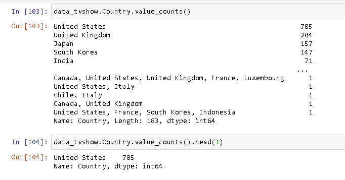

# Netflix Dataset Project

This project focuses on analyzing the Netflix Dataset. The dataset contains information about TV Shows and Movies available on Netflix until 2021

## Data Loading and Exploration
I will use the Pandas library to import and explore the dataset. The dataset is in CSV format. I will use the `pd.read_csv` function to import the dataset and store it in a DataFrame named 'data'.

### Basic Data Exploration Functions
- head function: Displays the top records of the dataset
- tail function: Displays the bottom records of the dataset
- shape function: Shows the number of rows and columns in the dataset

## Data Cleaning
- duplicate function: Used to remove duplicate records
- isnull function: Used to find null values

    

## Data Analysis and Visualization
- `isin` function: Used to filter data based on specific values
- `str.contains` function: Used to filter data based on string patterns
- `to_datetime` function: Used to convert strings to datetime objects
- `groupby` function: Used to group data based on specific criteria
- `min`, `max`, and `mean` functions: Used to calculate statistical measures
- Seaborn library: Used to create visually appealing bar graphs

     

## Data Manipulation
- Creating new columns
- Creating new DataFrames

  

  

  
